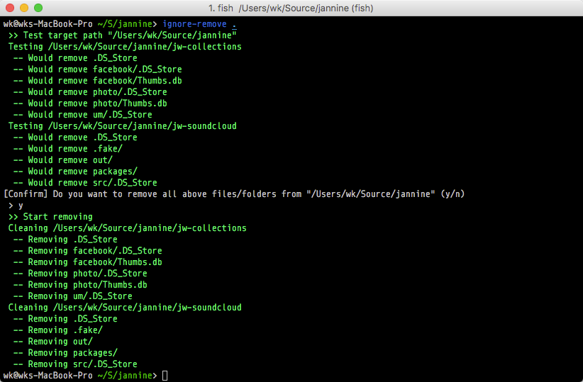

## Remove untracted files from repository's directory

[](https://travis-ci.org/wk-j/ignore-remover)

This's a wrapper of `git clean -Xnf`

Inspired by [surrealist/ignore-remover](https://github.com/surrealist/ignore-remover)



## Installation

```
> npm install -g ignore-remover
```

## Usage

```
> ignore-remove <TargetDirectory>
```