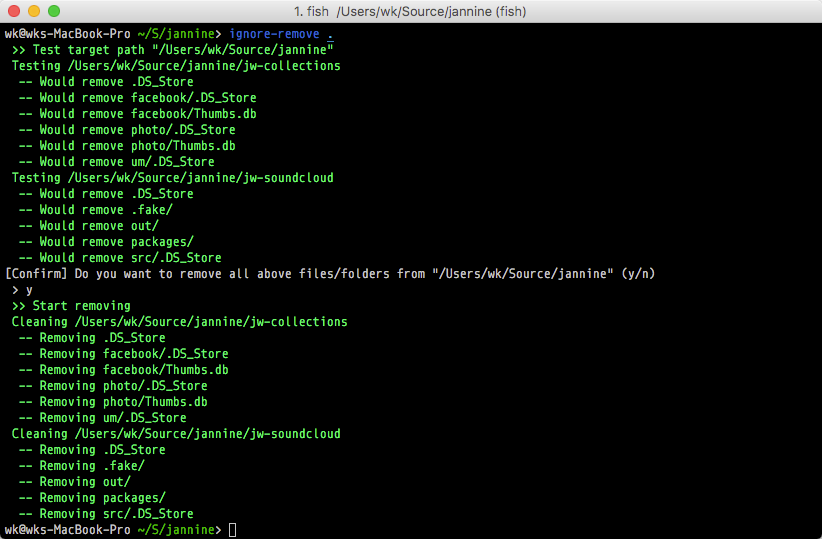

## Remove untracted files from repository's directory

This is a wrapper of `git clean -Xnf`

Inspired by [surrealist/ignore-remover](https://github.com/surrealist/ignore-remover)



## Installation

```bash
> dotnet tool install -g wk.IgnoreRemover
```

## Usage

```bash
> wk-ignore-remove <TargetDirectory>
```